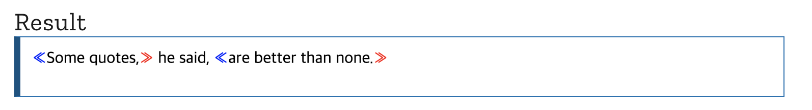

## ✔ TO-DO

- 스타벅스 클론 코딩(메인 페이지 추가)

## 💾 배운 것

CSS <br />
::after : 요소의 맨 마지막 자식으로 의사 요소를 하나 생성 <br />
::before : 요소의 맨 처음 자식으로 의사 요소를 하나 생성

```html
<q>Some quotes,</q> he said, <q>are better than none.</q>
```

```css
q::before {
  content: "«";
  color: blue;
}

q::after {
  content: "»";
  color: red;
}
```



## 📝 메모
